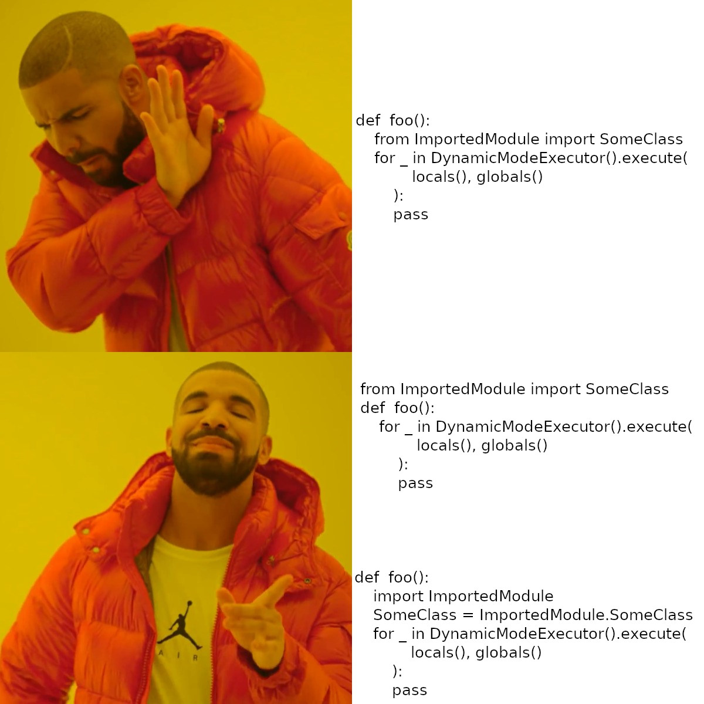

.. dynamic-executor documentation master file, created by
   sphinx-quickstart on Wed Feb 14 18:20:57 2024.
   You can adapt this file completely to your liking, but it should at least
   contain the root `toctree` directive.

Welcome to dynamic-executor's documentation!
============================================

.. toctree::
   :maxdepth: 2
   :caption: Contents:

   modules

Dynamic-executor library for changing python code during runtime
========================
*Remember this moment when your test ran and after a few minutes failed on some seemingly obvious error so you had to fix it, than restart it just to see it fail only a few lines of code further? If not greate, but if yes be sure to check dynamic executor which gracefully resolves such problems.*

Dynamic python is ment to be used in test development for creating and updating tests or wherever the need arises to change the code during runtime and have results visible instantaneously without restarting. The main functionality is provided by `DynamicModeExecutor().execute` generator that reloads all project-root modules (neither builtin not venv modules are reloaded).

Why not importlib.reload
========================
While importlib reload is a default built-in solution that provides basic functionality of reloading modules and it is used inside dynamic executor is has several drawbacks, namely:

- it doesn't preserve import path. If reimported module is used in an intermediate modul to modify it's contents the intermediate module isn't reloaded automatically;

- it doesn't keep track of created instances. Reloading module with classed causes them to be recreated therefore breaking a link between them and their instances which causes isinstance() and issubclass() checks to fail. This issue is prevented with usage of DynamicClass inheritance;

- reload doesn't work automatically, so each change to the code has to be detected or reloaded manually. In case of dynamic_executor all modules are reloaded by default on start of each iteration;

- reload can't change local variables. Using reload causes only module instance to change when variables imported using from remain unaltered. dynamic_executor updated those variables as the modules are reloaded.

An Elusive Bug
========================
As for today executor doesn't work properly when local import (in a scope of a function) using from can't be updated. Other configurations like global import with from or local import without from work as expected.

A Tournament to Slay the Elusive Bug
========================
Esteemed developers, hear me now as I beckon forth the valiant souls who dare to tread the hallowed grounds of our digital frontier! A challenge of unparalleled magnitude has befallen us, a bug so cunning, so elusive, that it eludes the grasp of our noble endeavors.

Behold, a foe entrenched within the shadows of our code, wherefrom the depths of local scopes, it thwarts our every attempt at vanquishment! Yes, my comrades, within the annals of our sacred repositories lies the elusive bug, residing in the enigmatic chambers of "test_nested_reimport_with_modification/test_class_reimport_local.py" and its kin, evading even the most astute of seekers.

Noble digital craftsmen, in our quest to vanquish the elusive bug, it is imperative to acknowledge that while this foe remains undefeated, it has been contained within its current form. Fear not, for there exists a strategy to navigate around its treacherous grip unscathed. By heeding the wisdom of importing in the global scope or employing import without the use of 'from', we can gracefully sidestep the clutches of this formidable adversary.

Yet, let us not only seek triumph for the sake of our own glory, but also in the spirit of camaraderie and shared achievement. As a testament to this, I extend an offer of contribution to our repository, and pledge to immortalize the valiant souls who emerge victorious in this battle. Among the authors of our repository, there shall stand proudly the name of the first to slay the beast, their triumph immortalized for posterity.

Therefore, let every keystroke resonate with the fervor of our collective determination, as we forge ahead with unwavering resolve. Together, as a fellowship of code warriors, we shall prevail in this epic tournament to conquer the indomitable bug!

Indices and tables
==================

* :ref:`genindex`
* :ref:`modindex`
* :ref:`search`
